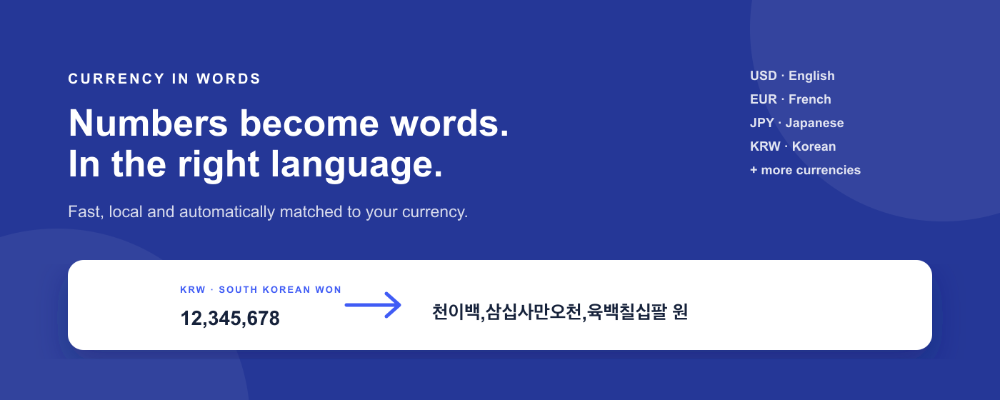
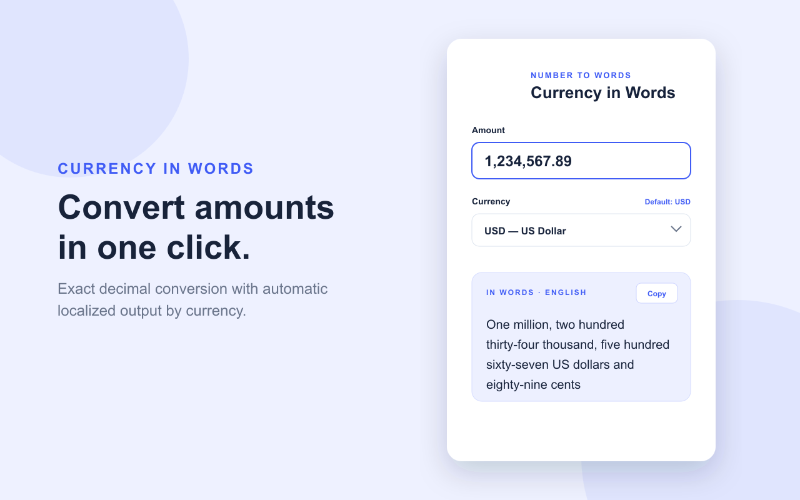
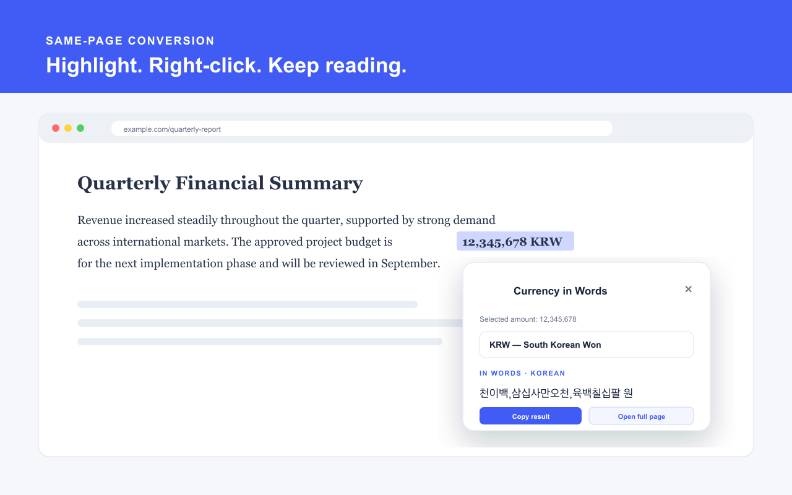
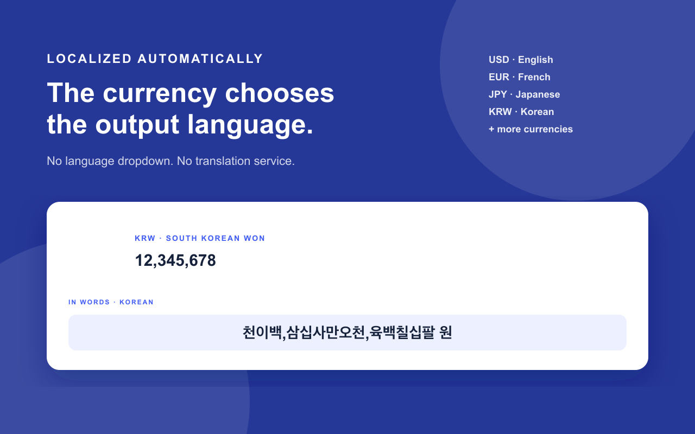

<p align="center">
  
</p>

# Currency in Words

A privacy-friendly Chrome extension that converts numeric amounts into written
currency text. The selected currency automatically determines the output
language.

## Features

- Localized output for USD, EUR, GBP, CAD, AUD, JPY, CNY, INR, CHF, SGD, KRW,
  AED, and BHD
- Saved default currency using Chrome Sync with local-storage fallback
- Live thousands separators in the amount field
- Currency-specific decimal precision and rounding
- Korean output punctuated at the numeric three-digit boundaries
- Toolbar popup for direct conversion
- Right-click conversion of highlighted amounts in a same-page floating card
- Full result page available only when explicitly requested
- No AI, analytics, advertising, or external translation service

## Screenshots

### Toolbar converter



### Same-page right-click conversion



### Automatic localized output



## Install locally

1. Download or clone this repository.
2. Open `chrome://extensions`.
3. Enable **Developer mode**.
4. Select **Load unpacked**.
5. Choose this repository folder.

## Right-click conversion

Highlight a numeric amount on a webpage, right-click it, and choose **Convert
selection to currency words**. The result appears in a floating card on the
same page. The extension never navigates away automatically.

## Development

Run the conversion checks with:

```sh
node tests.js
```

## Privacy

The extension accesses only text that the user explicitly highlights before selecting the **Convert selection to currency words** right-click command.

The selected text is processed locally in the browser to identify and convert a numeric amount. It is not transmitted, retained, sold, or shared with the developer or third parties.

The extension stores only the user's default currency preference using Chrome Sync and local extension storage. The developer does not receive or access this preference.


## Support and bug reports

Found a bug or have a feature request? Please [open an issue on GitHub](https://github.com/imju/currency-in-words/issues).

Before creating a new issue, check whether a similar issue has already been reported.

When reporting a problem, please include:

- Extension version
- Chrome version
- Selected currency
- Example input
- Expected result
- Actual result
